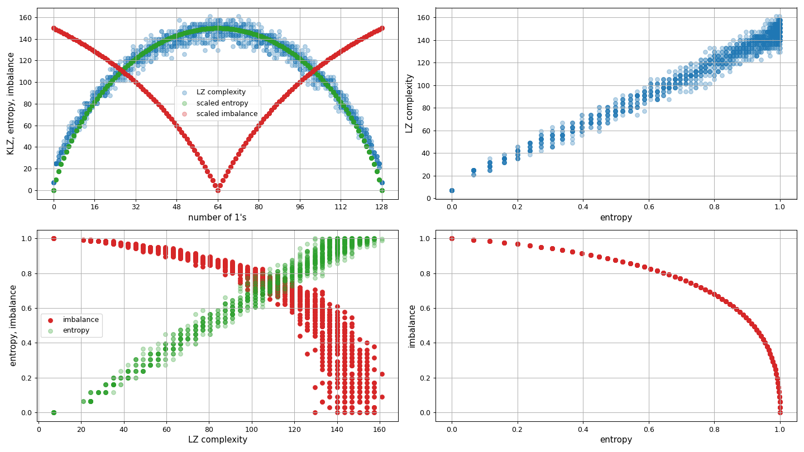
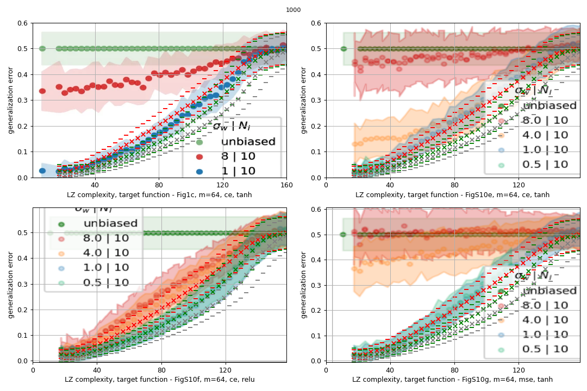

## Context

A random boolean function which maps each of the 7bit strings to a **0** or a **1** basically assigns
a value independently of the actual string itself. The following python code makes the context explicit:

###### Algorithm 0

```python
def algorithm_0(input_strings):
    """
    input_strings: a list of n-bit strings
    """
    y = []

    # for each string in the list
    for x in input_strings:
        # assign a random label, no dependence between x and the label value 
        y.append(np.random.choice([0, 1]))

    return np.asarray(y)
```

The above code is equivalent to:

###### Algorithm 1

```python
def algorithm_1(input_strings):
    return np.random.choice([0, 1], size=len(input_strings))
```

However, the previous mapping functions will produce most of the time strings with approximately
the same number of **1**s and **0**s. For the study at hand we want to pick functions with varying LZ complexities which
means choosing the number of **1**s and **0**s. To achieve this we could use the following:

###### Algorithm 2

```python
def algorithm_2(input_strings, k):
    """
    k: the number of 1s in the output string
    """

    # initialize a string with k 1s
    y = [1] * k

    # pad the string with zeros until the desired length is reached 
    y.extend([0] * (len(input_strings) - k))

    # shuffle the string - notice again no dependence between input_strings and labels
    np.random.shuffle(y)

    return np.asarray(y)
```

---


For the 128bit strings the LZ complexity ranges roughly between 0 and 160.
Notice that the LZ complexity is highly correlated with the number of 1s in the mapping function. The lower the
amount of 1s, the higher the amount of 0s, therefore creating a class imbalance in the training and test set.
The class imbalance is defined as: `min(n1,n0)/max(n1,n0)`, where n1 and n0 are the number of 1s and 0s in the mapping
function.

[//]: # (![alt text]&#40;LZ_entroy_vs_no1s.png "Title"&#41;)


Figure1: LZ complexity, entropy, class imbalance.

---
Datasets created by random boolean mappings have the feature that there is no consistent relation between
an input string and its label. There is no similarity between train and test dataset nor between examples of the same
class. Although neural networks are able to minimize the error on the training set, the test set does not bear any
resemblance to the train set, thus making it impossible to
generalize. However, Figures in the [paper](https://www.nature.com/articles/s41467-024-54813-x) show a decreasing
generalization error as the LZ complexity of the mapping
function decreases. This creates a tension between what ones expects from random datasets and these results.

One possible explanation is due to the large class imbalance present in the data.
An LZ complexity of 40 corresponds to about four **1**s and 124 **0**2 (and vice versa). Splitting this dataset in half
one would expect on average two **1**s in the train and test set. All
the remaining labels are **0**s. If one would predict only zeros for the test set, the accuracy, defined by the amount
of
correct y_true/y_pred matches, would actually be very high (62 out of 64 **0**s would be correctly matched), therefore
the error would be 1-62/64=0.03125. This indicates a high correlation between the accuracy and the class imbalance.
One can therefore test the following hypothesis:

**A neural network trained on random input/output binary
mappings will learn the class statistics and at inference time would predict a 0 or a 1 based on the frequency
of those classes in the train data.**

Below are 3 variations on the same idea.

### Hypothesis 1

A neural network trained on random input/output binary
mappings will learn the class statistics and at inference time would predict a **0** or a **1** using the exact
probabilities of observing a **0** or a **1** in the train data.

### Hypothesis 2

A neural network trained on random input/output binary
mappings will learn the class statistics and at inference time would predict a **0** or a **1** using the extracted
probabilities of observing a **0** or a **1** in the train data, emphasizing the class with the highest probability.

### Hypothesis 3

A toy model: always bet on the class with the highest probability.


---

## Results



Figure2 shows the predictions of the three hypotheses superimposed on the results shown
in the paper. The experiments were run 1000 times.

- red crosses are the means and standard deviations for [Hypothesis 1](#hypothesis-1)
- green crosses are the means and standard deviations for [Hypothesis 2](#hypothesis-2)
- gray crosses are the means and standard deviations for [Hypothesis 3](#hypothesis-3)

Notice the very good overlap between the means and error bars in the lower-left panel which compares
[Hypothesis 2](#hypothesis-2) with models trained with `relu` activations. More details on how exactly the emphasis is
put on the classes with higher probabilities in the code: [hypothesis_tester.py](hypothesis_tester.py)

[Hypothesis 1](#hypothesis-1) also matches
the experimental curves in the right panels, though not as well. There seems to be a slightly higher generalization
error as compared to [Hypothesis 1](#hypothesis-1) which means that the model did not capture the statistics so well.

On the more philosophical side, it seems that simplicity wins: if one cannot find an algorithm which maps inputs to
outputs, then we can be better off betting on the class with the highest probability as calculated from the training
set. The toy model appears on average as a better predictor for random boolean mappings than any of the neural models. 
