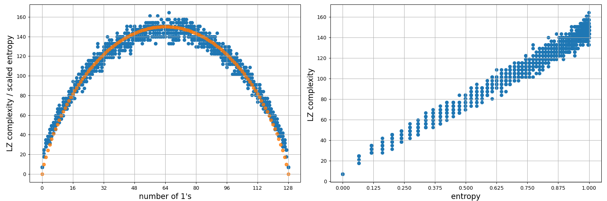

## Context

A random boolean function which maps each of the 7bit strings to a **0** or a **1** basically assigns
a value independently of the actual string itself. The following python code makes the context explicit:

###### Algorithm 0

```python
def algorithm_0(input_strings):
    """
    input_strings: a list of n-bit strings
    """
    y = []

    # for each string in the list
    for x in input_strings:
        # assign a random label, no dependence between x and the label value 
        y.append(np.random.choice([0, 1]))

    return np.asarray(y)
```

The above code is equivalent to:

###### Algorithm 1

```python
def algorithm_1(input_strings):
    return np.random.choice([0, 1], size=len(input_strings))
```

However, the previous mapping functions will produce most of the time strings with approximately
the same number of **1**s and **0**s. For the study at hand we want to pick functions with varying LZ complexities which
means choosing the number of **1**s and **0**s. To achieve this we could use the following:

###### Algorithm 2

```python
def algorithm_2(input_strings, k):
    """
    k: the number of 1s in the output string
    """

    # initialize a string with k 1s
    y = [1] * k

    # pad the string with zeros until the desired length is reached 
    y.extend([0] * (len(input_strings) - k))

    # shuffle the string - notice again no dependence between input_strings and labels
    np.random.shuffle(y)

    return np.asarray(y)
```

For the 128bit strings the LZ complexity ranges roughly between 0 and 160.

[//]: # (![alt text]&#40;LZ_entroy_vs_no1s.png "Title"&#41;)


<p style="text-align:center;">Figure1</p>

<br>

Datasets created by random boolean mappings have the feature that there is no consistent relation between
an input string and its label. There is no similarity between train and test dataset nor between examples of the same
class. Although neural networks are able to minimize the error on the training set, the test set does not bear any
resemblance to the train set, thus making it impossible to
generalize. However, Figures in the [paper](https://www.nature.com/articles/s41467-024-54813-x) show a decreasing
generalization error as the LZ complexity of the mapping
function decreases. This creates a tension between what ones expects from random datasets and these results.

## Hypothesis 1

Since there is no relation between inputs and outputs a neural network which reaches 0 error on the train set will
only learn the statistics of the 0/1 labels in the train set: how frequently 0 and 1 appears in the train data.
For the test data it only outputs a 0 or a 1 based on the learned probabilities.

## Hypothesis 2

For layers with `relu` activations and imbalanced number of classes in the train set the model learns the class 
statistics but emphasizes classes with more examples.
More details in [hypothesis_tester.py](hypothesis_tester.py)


## Hypothesis 3

Always bet on the class with the highest probability.


## Probability Learner


<p style="text-align:center;">Figure2</p>

<br>


Figure2 shows the predictions of the three learning hypotheses superimposed on the results shown
in the paper. 
- red crosses are the means and standard deviations for [Hypothesis 1](#hypothesis-1) 
- green crosses are the means and standard deviations for [Hypothesis 2](#hypothesis-2)
- gray crosses are the means and standard deviations for [Hypothesis 3](#hypothesis-3)

Notice the very good overlap between the means and error bars in the lower-left panel which compares 
[Hypothesis 2](#hypothesis-2) with models trained with `relu` activations. [Hypothesis 1](#hypothesis-1) also matches 
the experimental curves in the right panels, though not as well. There seems to be a slightly higher generalization 
error as compared to [Hypothesis 1](#hypothesis-1) which means that the model did not capture the statistics so well.


On the more philosophical side, it seems that if one cannot find an algorithm which maps inputs to outputs, then we 
can be better off betting on the class with the highest probability as calculated from the training set.


[//]: # (in the upper-right corner which)

[//]: # (compares the theoretical predictions with the results frm FigS10e, models trained with cross-entropy loss with tanh)

[//]: # (activations &#40;identical networks to Figure 1&#40;c&#41; from the main paper&#41;.)


